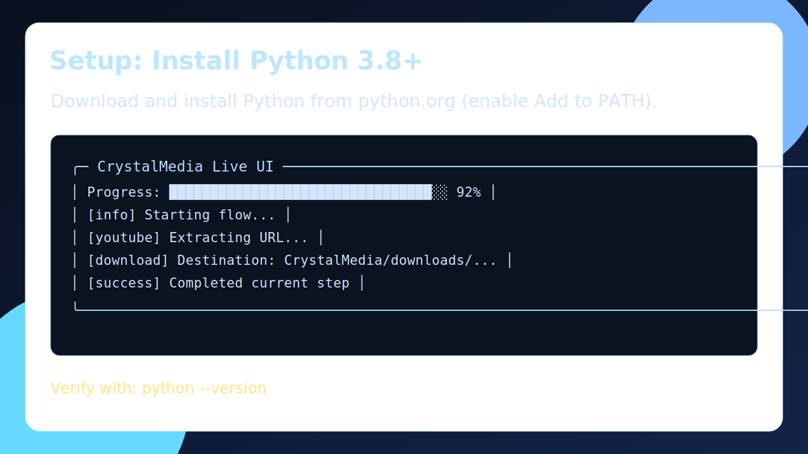
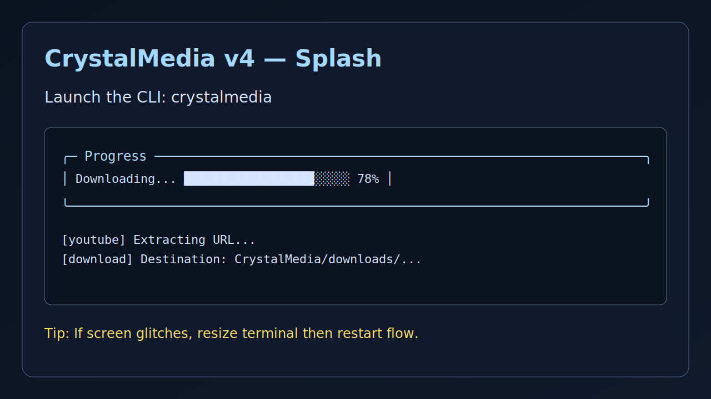
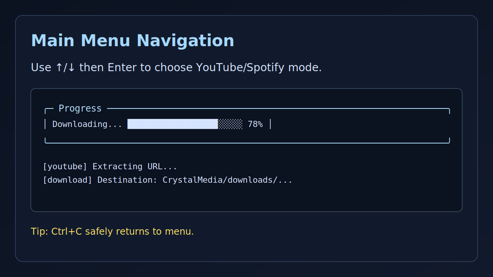
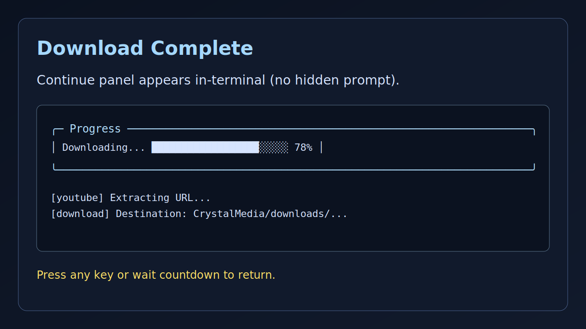
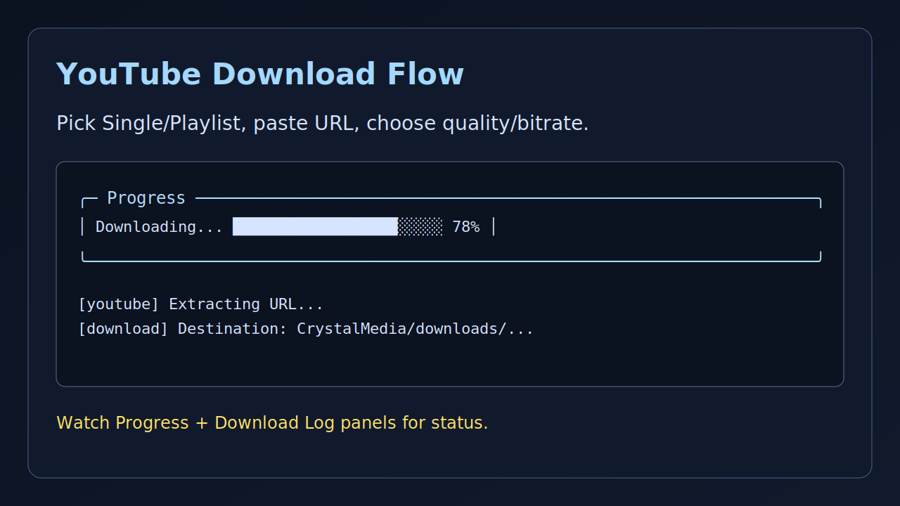
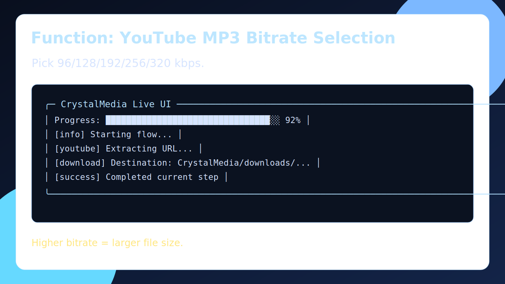
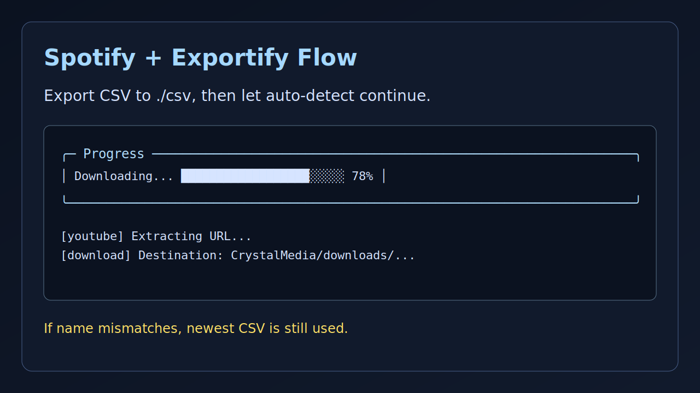
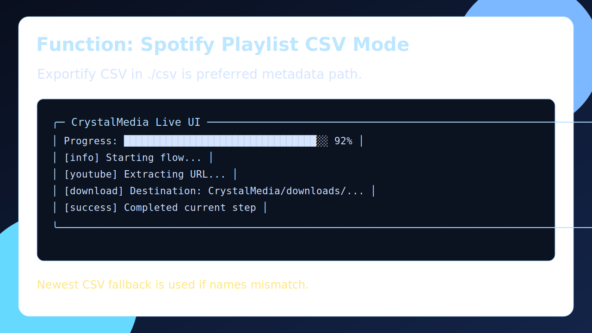
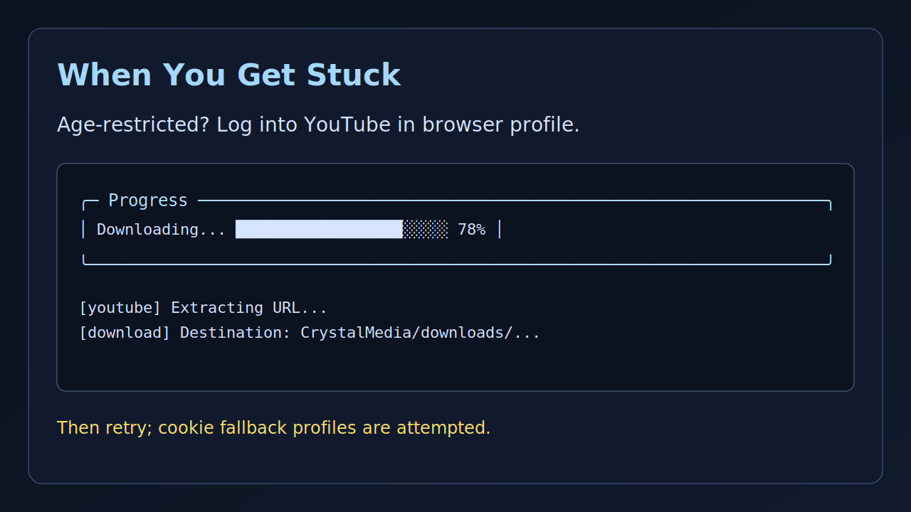
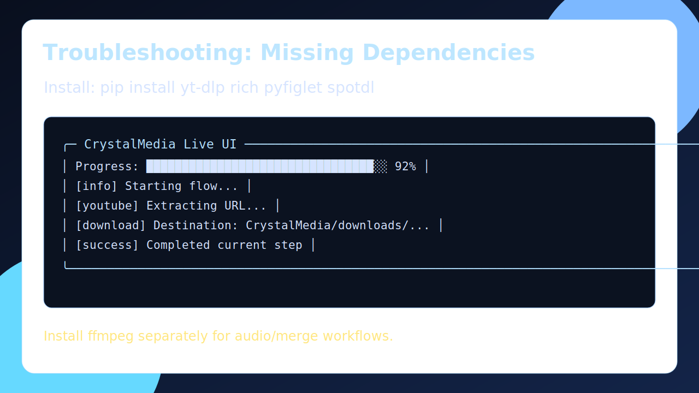

# 💎 CrystalMedia

> **A hyper-interactive terminal downloader for YouTube MP4/MP3 with a live Rich UI.**

[](./LICENSE)
[](#-requirements)


---

## ⚡ Jump To

- [🚀 30-Second Quick Start](#-30-second-quick-start)
- [🧪 Interactive README + Full Visual Walkthrough](#-interactive-readme--full-visual-walkthrough)
- [🎮 Interactive Walkthrough](#-interactive-walkthrough)
- [⌨️ Controls Cheatsheet](#️-controls-cheatsheet)
- [🧠 Download Modes](#-download-modes)
- [🖥️ Live UI Preview](#️-live-ui-preview)
- [📁 Output Structure](#-output-structure)
- [🛠 Requirements](#-requirements)
- [❗ MIT License + Legal Warning](#-mit-license--legal-warning)

---

## 🚀 30-Second Quick Start

```bash
# From PyPI (recommended)
pip install crystalmedia
crystalmedia

# From source
git clone https://github.com/Thegamerprogrammer/CrystalMedia.git
cd CrystalMedia
pip install .
crystalmedia
```

On first launch, CrystalMedia runs a dependency preflight/status check and self-healing diagnostics. Runtime auto-install of dependencies is disabled for packaging safety; install/update dependencies through pip.

It now also initializes output configuration once (`crystalmedia_config.json`) and defaults downloads/logs to `CrystalMedia_output/` unless you choose a custom path.

---


## 🧪 Interactive README + Full Visual Walkthrough

Before install, you can explore a modern clickable mini site + complete visual docs:

- **Interactive README (glass UI):** `docs/interactive-readme.html`
- **Pre-install demo:** `docs/interactive-demo.html`
- **PyPI page:** https://pypi.org/project/crystalmedia/

> On Windows, open `docs\interactive-readme.html` directly in your browser.

### Full Screenshot Gallery (Setup + Functions + Troubleshooting)

#### Setup



#### Core UI




#### YouTube Functions




#### Spotify Functions




#### When You Get Stuck




---

## 🎮 Interactive Walkthrough

When the app starts, the flow is designed to feel game-like and guided:

1. **Splash appears** (`CrystalMedia` logo + version)
2. **Main menu** opens (YouTube Video / YouTube Music / Spotify / Exit)
3. You choose (all animated with the starfield):
   - Single item or playlist
   - URL
   - MP4 quality or MP3 bitrate
   - JavaScript runtime preference (Auto / Deno-first / Node-first)
4. **Live UI kicks in**:
   - Header panel with current context
   - `Progress` panel (single progress bar)
   - `Download Log` panel (bounded recent yt-dlp events)
5. On completion, timeout prompt waits for input (or auto-returns)

---

## ⌨️ Controls Cheatsheet

| Action | Key |
|---|---|
| Move up/down in menu | `↑ / ↓` |
| Select menu item | `Enter` |
| Skip wait timer / continue now | `Any key` or `Enter` |
| Interrupt current flow | `Ctrl + C` |

---

## 🧠 Download Modes

### 🎬 YouTube Video (MP4)
- Quality presets: low → best available
- Single or playlist
- Remux/postprocess handling with ffmpeg

### 🎵 YouTube Music (MP3)
- Bitrate presets: 96 → 320 kbps
- Single or playlist
- Audio extraction postprocessing

### 🎧 Spotify (Exportify-first Playlist Mode)
- **Single track**: reads Spotify metadata and downloads via `yt-dlp` search (with automatic browser-cookie fallback for age-restricted YouTube matches).
- **Playlist/album**: **Exportify CSV is the primary path**.
  1. Open your playlist URL in CrystalMedia.
  2. CrystalMedia opens `vendor/exportify/index.html` helper + Exportify in browser.
  3. Export the **same playlist** and save CSV in `./csv` (next to `CrystalMedia.py`).
  4. Filename matching is used as a hint; CrystalMedia will still try the newest CSV if names do not match.
  5. CrystalMedia reads that CSV and downloads each song via `yt-dlp` search.

If no CSV is found, CrystalMedia attempts direct Spotify page scraping fallback.


### 🍪 Age-restricted YouTube matches (Spotify fallback)
- CrystalMedia now auto-tries `yt-dlp --cookies-from-browser` profiles when YouTube returns age/sign-in restrictions.
- For best results, sign in to YouTube in your normal (non-incognito) browser profile first.
- If browser-cookie extraction still fails, export a Netscape cookies file and pass it manually in yt-dlp workflows.

---

## 🖥️ Live UI Preview

CrystalMedia uses a fixed Rich layout to keep output readable:

- **Animated splash header:** CrystalMedia logo + live starfield + current download context
- **Progress panel:** one progress bar (download/processing/merging)
- **Download Log panel:** compact rolling logs with truncation + color tags

This minimizes noisy terminal spam and keeps the interface focused.

---

## 📁 Output Structure

```text
CrystalMedia_output/   # default root (configurable once at startup)
├── downloads/
│   ├── YT VIDEO/
│   │   ├── Single/
│   │   └── Playlist/
│   ├── YT MUSIC/
│   │   ├── Single/
│   │   └── Playlist/
│   └── SPOTIFY/
│       ├── Single/
│       └── Playlist/
└── logs/
    ├── log.txt
    ├── crash.txt
    └── deps.txt

crystalmedia_config.json  # persists custom output_root
```

---

## 🛠 Requirements

- Python **3.8+**
- Internet connection
- FFmpeg (install via your OS package manager, or use Docker below)

---


## 🐳 Docker (no host Python/FFmpeg install required)

If you prefer not to install Python/FFmpeg directly on your machine, run CrystalMedia in Docker:

```bash
docker build -t crystalmedia .
```

Linux/macOS:
```bash
docker run --rm -it \
  -v "$(pwd)/CrystalMedia:/app/CrystalMedia" \
  -v "$(pwd)/csv:/app/csv" \
  crystalmedia
```

Windows PowerShell:
```powershell
docker run --rm -it `
  -v "${PWD}/CrystalMedia:/app/CrystalMedia" `
  -v "${PWD}/csv:/app/csv" `
  crystalmedia
```

This keeps your host clean while still running the full TUI flow.

---

## ❗ MIT License + Legal Warning

CrystalMedia is released under the **MIT License** (see [`LICENSE`](./LICENSE)).

### Important warning

- The MIT License allows broad use/modification/distribution of this software.
- **It does not grant rights to download copyrighted media without permission.**
- You are solely responsible for how you use this tool and for compliance with local laws/platform terms.

Use responsibly and only with content you are authorized to download.

- No Affiliation
CrystalMedia is an independent, unofficial, community-developed project with no affiliation, endorsement, or partnership with YouTube, Google LLC, Spotify AB, or any related entities.
Dependency Notices
- This project uses third-party libraries including yt-dlp and relies on user-provided data/credentials. The authors do not control, modify, or distribute these dependencies in any infringing manner.
 Takedown Compliance
- Indemnification
- By using CrystalMedia, you agree to indemnify, defend, and hold harmless
the authors, contributors, maintainers, and distributors of this software
from and against any and all claims, damages, losses, liabilities, costs,
or expenses (including reasonable attorneys' fees) arising from or related
to your use, misuse, distribution, or operation of the software.

- This includes, but is not limited to, claims involving copyright
infringement, violations of platform terms of service, or violations of
local, national, or international laws. The responsibility for ensuring
that the use of CrystalMedia complies with applicable laws and platform
policies rests solely with the user.

- By using CrystalMedia, you agree to indemnify and hold harmless the authors, contributors, and any associated parties from any claims, damages, losses, liabilities, costs, or expenses (including attorneys' fees) arising from your use or misuse of the software.

## CrystalMedia does not circumvent digital rights management (DRM).
## It relies on publicly available interfaces and third-party libraries.

---

## 🧯 Troubleshooting

- If terminal rendering looks off after a resize, return to the main menu and start the download again.
- Check `CrystalMedia/logs/crash.txt` for error traces and `CrystalMedia/logs/deps.txt` for dependency snapshots after startup.
- On unrecoverable errors, CrystalMedia shows a fatal error panel, writes details to `CrystalMedia/logs/crash.txt`, and exits cleanly.

---

---

PRs are welcome for UI polish, reliability improvements, and Spotify-mode recovery when upstream ecosystem changes stabilize.


## 🧾 Exportify CSV (Playlist) Quick Notes

- CSV files **must be in** `./csv` (relative to where you run `CrystalMedia.py`).
- Leave filename blank in prompt to auto-detect latest CSV in `./csv` that matches playlist name.
- Playlist title is auto-derived from the Spotify playlist link and used for fuzzy CSV matching.
